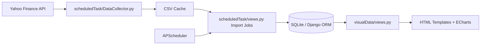

# Forex Local Visual

[](LICENSE)


Open-source Django project for collecting and visualizing forex, commodity, and crypto market data.

## Languages

- English: [docs/README.en.md](docs/README.en.md)
- 中文: [docs/README.zh-CN.md](docs/README.zh-CN.md)
- 日本語: [docs/README.ja.md](docs/README.ja.md)

## Features

- Scheduled market data collection (historical, recent, training)
- Django ORM persistence (SQLite default)
- Interactive visualization with pyecharts
- Modular app design for future model and strategy integration

## Architecture



## Repository Layout

- forex/: Django project settings and routing
- scheduledTask/: scheduler, collectors, import jobs
- visualData/: view layer and templates
- processData/: data processing extension area
- static/: static assets
- docs/: multilingual documentation

## Quick Start (Windows PowerShell)

1. Create and activate virtual environment.

```powershell
cd forex\forex
python -m venv .venv
.\.venv\Scripts\Activate.ps1
```

2. Install dependencies.

```powershell
pip install -r requirements.txt
```

3. Configure environment variables.

```powershell
Copy-Item .env.example .env
```

Required variables:

- DJANGO_SECRET_KEY
- DJANGO_DEBUG
- DJANGO_ALLOWED_HOSTS

4. Migrate and run.

```powershell
python manage.py migrate
python manage.py runserver
```

Default URL: http://127.0.0.1:8000/visual/

## First-Time Data Collection

The chart pages depend on records in the local database. Right after clone and migration, the database is empty, so pages can show no data.

Run a one-time manual collection/import:

```powershell
python manage.py shell -c "from scheduledTask.views import collect_history_data, collect_recent_data; collect_history_data(); collect_recent_data()"
```

Verify records were imported:

```powershell
python manage.py shell -c "from scheduledTask.models import HistoricalData, RecentData; print('Historical:', HistoricalData.objects.count()); print('Recent:', RecentData.objects.count())"
```

Notes:

- Data source is Yahoo Finance via yfinance.
- If you see `Too Many Requests. Rate limited. Try after a while.`, wait 15-60 minutes and run the collection command again.

## Development Workflow

```powershell
python manage.py check
python manage.py migrate --noinput
python manage.py runserver --noreload
```

## Contributing Guide

1. Fork this repository.
2. Create a feature branch from main.
3. Keep PR scope focused and include test/check evidence.
4. Ensure sensitive/local artifacts are not committed.
5. Open a pull request with context, motivation, and screenshots if UI changes are included.

## Security and Open-Source Hygiene

- Never commit .env files or secrets.
- Never commit local runtime artifacts such as db.sqlite3 and logs.
- Generated market CSV data is ignored by default.
- Use your own secret key for any non-local deployment.

## License

This project is licensed under the MIT License. See [LICENSE](LICENSE).
